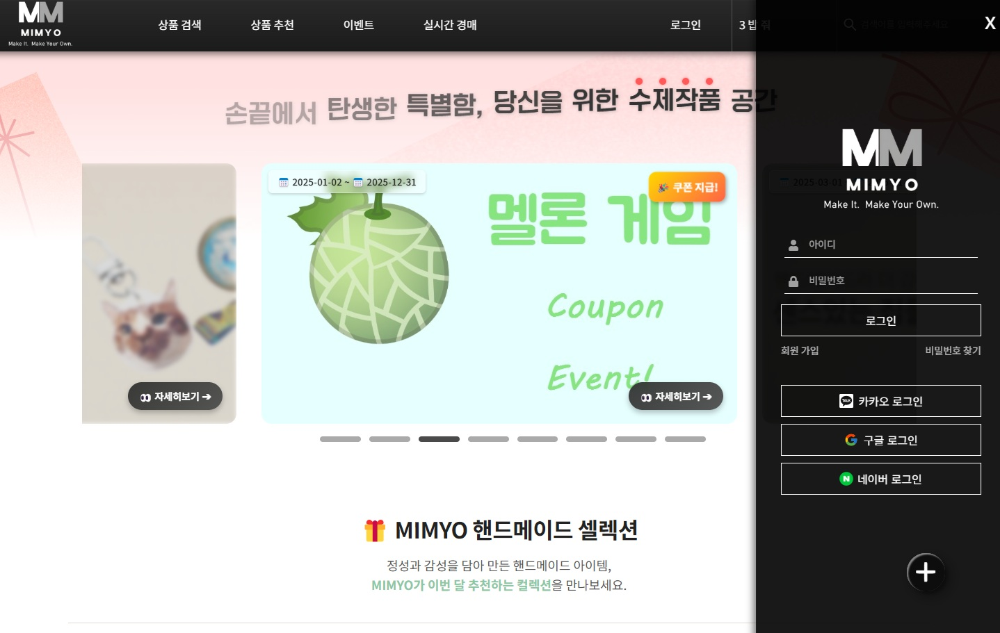

# 🧵 핸드메이드 쇼핑몰 - [ MIMYO ]

> 정성 가득한 핸드메이드 상품을 거래하는 커머스 플랫폼

 <!-- 스크린샷 경로는 알아서 수정 -->

---

📄 [프로젝트 상세 소개서 보기 (PDF)]([https://drive.google.com/file/d/파일ID/view?usp=sharing)](https://drive.google.com/file/d/1ZVTpuval2WbT_x1n-3tOS7dhkpnCJQ8C/view?usp=drive_link)
🌐 [👉 MIMYO 서비스 바로가기](https://mimyo.my)

---

## 🛠️ 주요 기술 스택

### 📌 Frontend
- React 22 / Redux Toolkit
- Styled Components / Tailwind CSS
- Chart.js (통계 시각화)
- Axios / React Router
- WebSocket (실시간 채팅, 경매)

### 📌 Backend
- Spring Boot / Spring Security / JWT 인증
- JPA / Hibernate
- MySQL / QueryDSL / Native SQL
- AWS / Naver Cloud / Ubuntu / Certbot (HTTPS)
- WebSocket / STOMP (실시간 경매, 채팅)

---

## 💡 프로젝트 기획 의도

> **실시간 + 커뮤니케이션 + 편의성**을 갖춘  
> 새로운 형태의 핸드메이드 커머스 플랫폼

---

### 🎯 기획 배경

- 핸드메이드 시장의 성장과 개인 맞춤형 상품 수요 증가  
- 작가와 소비자 간 **실시간 소통**을 통해 고유성과 희소성을 극대화  
- 대량생산 제품과 차별화된 **개성 중심의 쇼핑 경험** 제공

---

### ✅ 기대 효과

#### 👤 사용자 측면 기대 효과
- 유니크한 제품과 작가와의 1:1 소통 경험  
- 요청 제작, 리뷰, 후기 등 커뮤니티형 쇼핑 UX 구현

#### 👩‍🎨 판매자 측면 기대 효과
- 자체 브랜드 및 제품 노출 기회  
- 결제, 배송, 리뷰 등 기능 통합으로 제작에만 집중 가능

#### 🧑‍💼 관리자 측면 기대 효과
- 정산, 광고, 배너, 상품 등록을 통한 수익 구조 마련  
- 데이터 기반 상품 추천/분석 기능 내장

#### 💻 기술/개발 측면 기대 효과
- WebSocket, JWT, STOMP 기반의 실시간 통신 기능 직접 설계 및 운영  
- 회원가입 ~ 결제 ~ 정산까지 E2E 시스템 구축 경험

#### 📈 마케팅/비즈니스 측면 기대 효과
- 틈새시장 공략 및 감성 중심 타겟팅  
- 후기 공유 및 커뮤니티 요소로 브랜드 충성도 증가


## 🎯 핵심 기능

### 🛒 쇼핑 기능
- 일반 상품 & 경매 상품 분리
- 실시간 경매 참여, 자동 입찰 마감
- 찜 / 장바구니 / 쿠폰 할인 / 리뷰 작성

### 💳 주문 및 결제
- Toss Payments 연동
- 일반 결제 및 경매 낙찰 결제 처리
- 재고 동시성 처리 (판매중지 자동 전환)

### 👩‍🎨 판매자 기능
- 상품 등록/수정/삭제
- 월별 정산, 판매 통계 대시보드
- 실시간 배송 관리 (1분 후 자동 배송 완료 처리)

### 📊 관리자/유저 기능
- 마이페이지 (구매 내역, 포인트 적립, 문의 내역)
- 유저 활동 통계 (문의 수, 구매 금액 등)
- 이벤트 페이지 (쿠폰/홍보 링크 전환)

---

## 📦 폴더 구조 예시

```bash
📁 backend
 └── src/main/java/com/ict/serv
     ├── config       # 설정 파일 (Swagger, CORS, WebSocket 등)
     ├── context      # 사용자 인증 컨텍스트
     ├── controller   # REST API 컨트롤러
     ├── dto          # 요청/응답 DTO
     ├── entity       # JPA 엔티티
     ├── repository   # DB 접근 레이어
     ├── schedule     # 스케줄러 (예: 배송 자동 완료)
     ├── security     # JWT 및 OAuth2 보안 처리
     ├── service      # 비즈니스 로직
     ├── util         # 공용 유틸 클래스
     └── ServApplication.java  # 메인 실행 파일
 └── uploads          # 이미지 업로드 저장소
 └── resources         # 설정 파일 (application.yml 등)

📁 frontend
 └── src
     ├── css          # 공통 CSS
     ├── effect       # 애니메이션 / 인터랙션 효과
     ├── img          # 이미지 리소스
     ├── interact     # 공통 컴포넌트/인터랙션 핸들링
     ├── modal        # 팝업/모달 관련 UI
     ├── store        # Redux 상태 관리
     └── view         # 실제 페이지 구성
         ├── admin              # 관리자 페이지
         ├── auction            # 경매 관련 페이지
         ├── customerservice    # 고객센터, 문의 등
         ├── event              # 이벤트 페이지
         ├── product            # 상품 상세, 목록 등
         ├── recommend          # 추천 시스템
         ├── shipping           # 배송 조회/관리
         ├── submenu            # 서브 메뉴, 네비게이션 등
         └── user               # 마이페이지, 회원 관련
     ├── Header.jsx / Footer.jsx / Main.jsx 등 공통 레이아웃

📁 public               # 정적 파일 (favicon, index.html 등)
```
---

## 🙋‍♂️ 담당 역할 - 이건모 (조장)

> 프로젝트 기획부터 DB 설계, 핵심 기능 구현 및 배포까지 전체 주도

### 🧱 백엔드 핵심 구축
- Spring Boot 기반 전체 백엔드 구조 설계 및 개발
- DB 설계, JPA 매핑, QueryDSL / Native SQL 최적화
- JWT 기반 인증 구현 (구글/네이버/카카오 OAuth2 소셜 로그인 포함)
- 실시간 경매, 채팅 기능 (WebSocket + STOMP 기반)
- Toss Payments 연동 – 일반결제 + 경매 낙찰 결제 처리
- 자동 입찰 마감, 배송 자동 완료(스케줄링 처리), 이미지 업로드 기능 구현
- 유저 마이페이지 / 관리자 정산 / 활동 통계 기능 구현
- 이벤트 쿠폰 발급 및 이동 링크 이벤트 처리

### 🧠 프론트 협업 및 기능 개발
- Redux를 통한 상태관리 구조 설계 (모드, 로그인, 상품 조건 등)
- 관리자 페이지, 마이페이지, 상품 등록 UI/UX 연동
- 마이페이지에서 주문 내역, 정산 내역, 리뷰 및 찜 상품 UI 구현
- 상품 추천, 판매 통계, 실시간 검색 로그 수집 기능 구현

### 🌐 배포 및 인프라
- Naver Cloud Ubuntu 서버 구축 및 배포
- HTTPS 인증 (Let's Encrypt + Certbot), 도메인 연결
- 이미지 업로드 경로, 정적 파일 경로 설정
- 배포 시 ERD 설계 / DB 백업 / 로그 관리 / 브랜치 병합 관리

---

## 📝 MIMYO 후기

**이건모 – 조장**

파이널 프로젝트에서 팀장을 맡아 기획부터 개발, 배포까지 전체 과정을 리드해본 경험은 매우 값지고 인상 깊었습니다.  
처음에는 여러 명이 함께 작업하는 만큼 의견 충돌이나 갈등이 생기지 않을까 우려도 있었지만,  
팀원들이 적극적으로 소통해주고 저의 의견을 존중해준 덕분에 큰 마찰 없이 협업을 이어갈 수 있었습니다.

프로젝트는 초기에는 전체 구조를 설계하고 역할을 분담한 뒤, 직접 코드 구현에 돌입했습니다.  
처음 예상보다 복잡한 기능이 많았고, 진행이 순조로운 부분도 있었지만 프로젝트 규모가 커질수록 코드의 복잡도가 증가하며  
유지보수와 확장성 측면에서 개선한 부분도 보였습니다. 특히 **실시간 기능을 구현하면서 동시성 처리와 데이터 동기화의 어려움**을 체감했고,  
**초기에 구조를 탄탄하게 잡는 것의 중요성**을 다시금 느꼈습니다.

또한 데이터베이스 정규화의 중요성도 이번 경험을 통해 명확히 이해할 수 있었습니다.  
초기에 구조를 제대로 잡지 않으면 나중에 **데이터 처리와 쿼리 최적화**에서 큰 어려움을 겪게 된다는 점을 직접 경험했습니다.

한편, 배포 후 자동화된 공격 분석 / 서버에 무차별 접근하는 상황을 마주하면서,  
단순히 기능 구현뿐 아니라 **보안의 중요성** 역시 실감할 수 있었습니다.  
방화벽 설정, SSH 보안, 인증 방식 등 실무에서 요구되는 인프라 측면까지 고민해보게 된 계기가 되었습니다.

이 프로젝트는 단순한 결과물 제작을 넘어, 기획, 협업, 문제 해결, 성능 최적화, 보안 등  
**소프트웨어 개발 전반에 대해 실질적인 경험**을 쌓을 수 있었던 소중한 시간이었습니다.

> **고맙습니다. 미묘 팀원 여러분 😘**  
> `2025.05.08 마무리`
